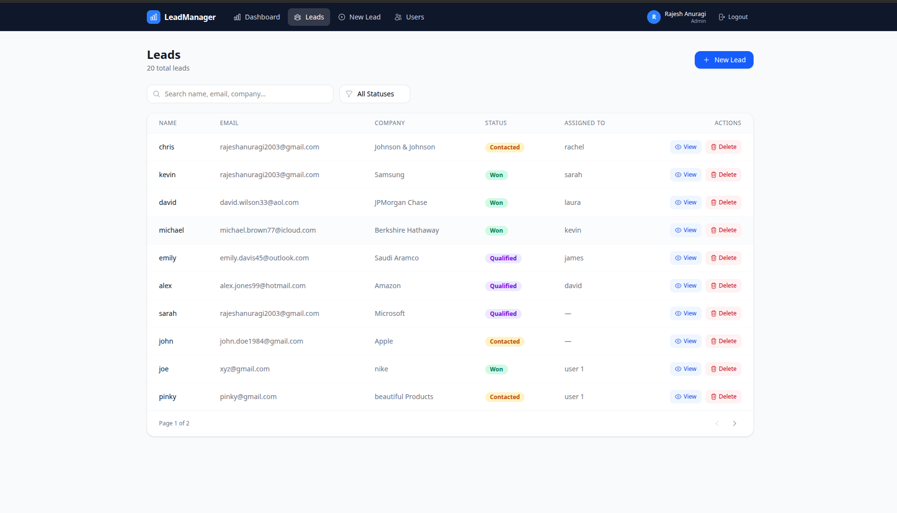
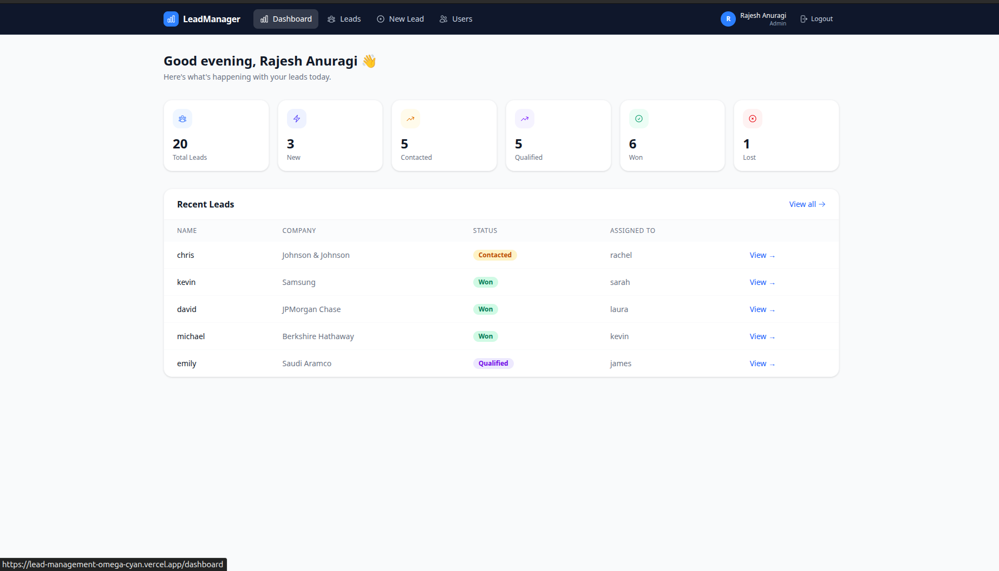
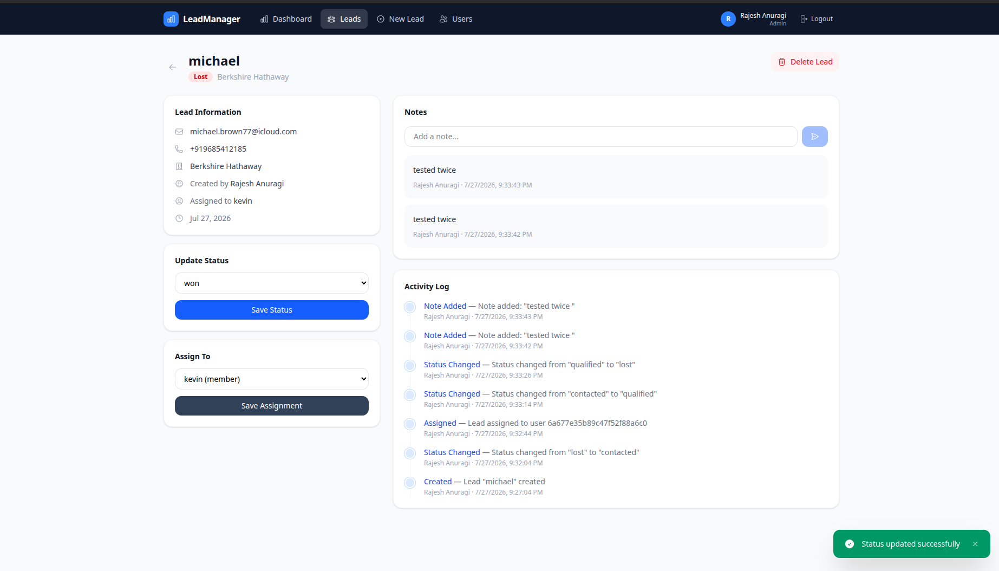
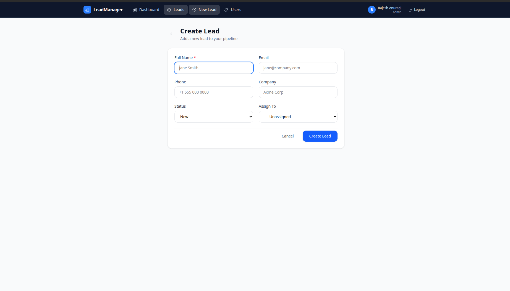
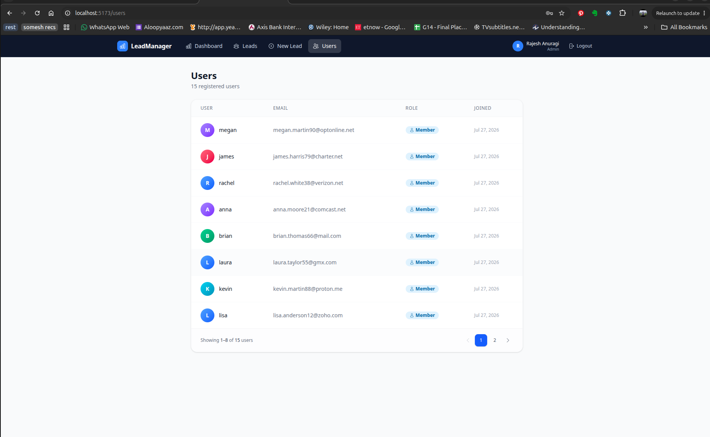
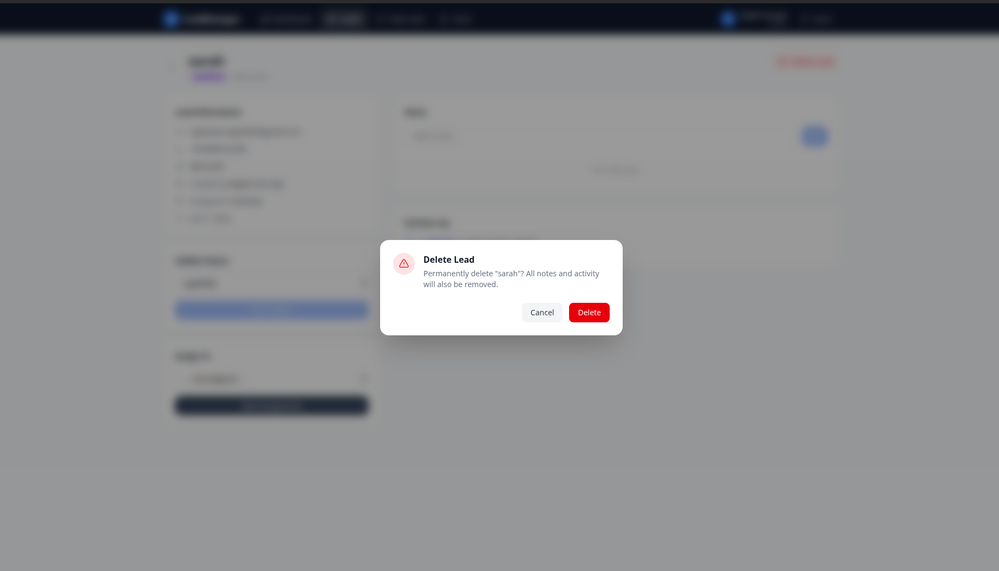

# LeadManager

A full-stack lead management system for sales teams. Admins can create and assign leads, while members manage their own pipeline — with notes, activity logs, and real-time status tracking.

**Live Demo:** [https://lead-management-omega-cyan.vercel.app](https://lead-management-omega-cyan.vercel.app)

---

## Demo Credentials

You can log in directly without registering:

| Role   | Email                              | Password   |
|--------|------------------------------------|------------|
| Admin  | `anuragi.rajesh24_ug@apu.edu.in`  | `anuragi`  |
| Member | `anna.moore21@comcast.net`        | `123456` |
| Member | `david.wilson33@aol.com`        | `123456` |

> The member account needs to be registered manually via `/register`. The admin account is live on the deployed app.

**Admin can:** create leads, delete leads, assign leads to members, view all users, update any field.

**Member can:** view their assigned leads, update lead status, add notes.

---

## Tech Stack

| Layer     | Technology                                        |
|-----------|---------------------------------------------------|
| Frontend  | React 19, Vite, Tailwind CSS v4, Heroicons        |
| Backend   | Node.js, Express                                  |
| Database  | MongoDB (Mongoose ODM)                            |
| Auth      | JWT + bcrypt, httpOnly cookies                    |
| HTTP      | Axios                                             |
| Routing   | React Router v7                                   |

---

## Screenshots

### Login


### Dashboard


### Leads List


### Lead Details


### Create Lead


### Users


### Delete Confirmation


---

## Features

- ✔ JWT Authentication
- ✔ Role-based Authorization (Admin / Member)
- ✔ Lead CRUD Operations
- ✔ Lead Assignment
- ✔ Notes Management
- ✔ Activity Timeline
- ✔ Search & Filtering
- ✔ Pagination
- ✔ Protected Routes
- ✔ Responsive Dashboard
- ✔ MongoDB Atlas Integration
- ✔ RESTful API
- ✔ Deployment on Render & Vercel

---

## Installation

### Prerequisites

- Node.js 18+
- A [MongoDB Atlas](https://www.mongodb.com/atlas) account (or local MongoDB)

### 1. Clone the repository

```bash
git clone https://github.com/AnuragiRajesh/Lead-Management.git
cd Lead-Management
```

### 2. Backend setup

```bash
cd backend
npm install
```

Create a `.env` file (see [Environment Variables](#environment-variables) below), then start the dev server:

```bash
npm run dev
```

The API will be available at `http://localhost:5000`.

### 3. Frontend setup

```bash
cd frontend
npm install
```

Create a `.env` file:

```env
VITE_API_URL=http://localhost:5000/api
```

Start the development server:

```bash
npm run dev
```

The app will be available at `http://localhost:5173`.

---

## Environment Variables

### Backend

Create `backend/.env`:

```env
PORT=5000
MONGO_URI=your_mongodb_connection_string
JWT_SECRET=your_secret_key
FRONTEND_URL=http://localhost:5173
```

| Variable       | Description                                         |
|----------------|-----------------------------------------------------|
| `PORT`         | Backend server port                                 |
| `MONGO_URI`    | MongoDB Atlas connection string                     |
| `JWT_SECRET`   | Secret used to sign JWT tokens                      |
| `FRONTEND_URL` | Allowed frontend origin for CORS                    |

### Frontend

Create `frontend/.env`:

```env
VITE_API_URL=http://localhost:5000/api
```

| Variable        | Description        |
|-----------------|--------------------|
| `VITE_API_URL`  | Backend API URL    |

For production (Vercel), set:

```env
VITE_API_URL=https://lead-management-bw2t.onrender.com/api
```

---

## API Endpoints

All protected routes require a `Bearer <token>` header or a valid `token` cookie.

### Auth — `/api/auth`

| Method | Endpoint    | Access | Description                     |
|--------|-------------|--------|---------------------------------|
| POST   | `/register` | Public | Register a new user             |
| POST   | `/login`    | Public | Login and receive a JWT         |
| POST   | `/logout`   | Private | Clear the auth cookie          |
| GET    | `/me`       | Private | Get the current logged-in user |
| GET    | `/users`    | Admin  | List all registered users       |

### Leads — `/api/leads`

| Method | Endpoint | Access       | Description                                         |
|--------|----------|--------------|-----------------------------------------------------|
| GET    | `/`      | Private      | List leads (paginated, searchable, filterable)      |
| GET    | `/:id`   | Private      | Get a single lead                                   |
| POST   | `/`      | Admin        | Create a new lead                                   |
| PUT    | `/:id`   | Admin/Member | Full update (admin) or status-only update (member)  |
| DELETE | `/:id`   | Admin        | Delete a lead                                       |

**Query parameters for `GET /api/leads`:**

| Param        | Example             | Description                     |
|--------------|---------------------|---------------------------------|
| `page`       | `?page=2`           | Page number (default: 1)        |
| `limit`      | `?limit=20`         | Results per page (default: 10)  |
| `search`     | `?search=john`      | Search by name, email, company  |
| `status`     | `?status=qualified` | Filter by lead status           |
| `assignedTo` | `?assignedTo=<id>`  | Filter by assigned user (admin) |

### Notes — `/api/notes`

| Method | Endpoint   | Access  | Description              |
|--------|------------|---------|--------------------------|
| POST   | `/`        | Private | Add a note to a lead     |
| GET    | `/:leadId` | Private | Get all notes for a lead |

### Activity — `/api/activity`

| Method | Endpoint   | Access  | Description                   |
|--------|------------|---------|-------------------------------|
| GET    | `/:leadId` | Private | Get activity log for a lead   |

---


## Deployment

| Part     | Platform                                                            | URL |
|----------|---------------------------------------------------------------------|-----|
| Frontend | [Vercel](https://vercel.com)                                        | https://lead-management-omega-cyan.vercel.app |
| Backend  | [Render](https://render.com)                                        | https://lead-management-bw2t.onrender.com |
| Database | [MongoDB Atlas](https://www.mongodb.com/atlas)                      | — |
| Source   | [GitHub](https://github.com/AnuragiRajesh/Lead-Management)          | https://github.com/AnuragiRajesh/Lead-Management |

### Backend (Render)

1. Create a new **Web Service** and connect your GitHub repo
2. Set the root directory to `backend/`
3. Build command: `npm install`
4. Start command: `npm start`
5. Add environment variables in the Render dashboard:

```
MONGO_URI
JWT_SECRET
FRONTEND_URL
PORT
```

### Frontend (Vercel)

1. Import the repo on Vercel
2. Set the root directory to `frontend/`
3. Add the environment variable:

```
VITE_API_URL=https://lead-management-bw2t.onrender.com/api
```

---

## Project Structure

```
lead-management/
├── backend/
│   ├── src/
│   │   ├── config/         # MongoDB connection
│   │   ├── controllers/    # Route handlers
│   │   ├── middleware/     # Auth (protect, adminOnly), error handler
│   │   ├── models/         # Mongoose schemas (User, Lead, Note, Activity)
│   │   ├── routes/         # Express routers
│   │   └── utils/          # generateToken, logActivity
│   ├── server.js
│   └── .env
└── frontend/
    ├── src/
    │   ├── api/            # Axios instance
    │   ├── components/     # Navbar, PrivateRoute, Toast, ConfirmDialog, StatusBadge
    │   ├── context/        # AuthContext
    │   └── pages/          # Login, Register, Dashboard, LeadList, LeadDetails, CreateLead, Users
    └── .env
```

---

## Future Improvements

- Email notifications
- File attachments
- Lead analytics dashboard
- Dark mode
- Password reset
- Unit and integration testing
- Docker support

---

## License

This project is licensed under the [MIT License](LICENSE).
